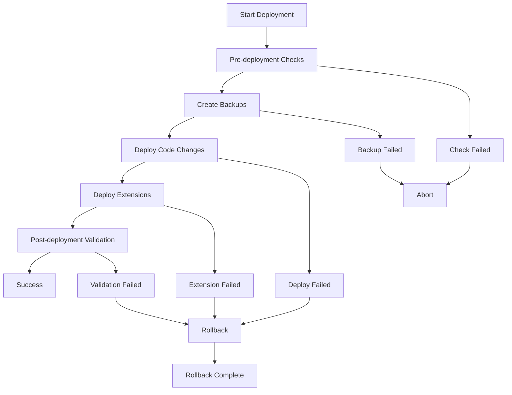

# Directus Safe Production Deployment System

A comprehensive, zero-data-loss deployment system for Directus applications that preserves production data while safely deploying code changes.

## Overview

This deployment system provides:

- **Zero Data Loss**: Preserves all production uploads, database content, and user data
- **Safe Deployments**: Automated backups before every deployment
- **Selective Sync**: Deploys only code changes, excluding production data
- **Rollback Capability**: Quick recovery to previous versions
- **Comprehensive Testing**: Automated verification of all components

## Quick Start

### Prerequisites

- `rsync` (for file synchronization)
- `python3` (for JSON configuration parsing)
- `pg_dump` and `pg_isready` (for PostgreSQL database operations)
- Proper file permissions on source and target directories

### Basic Deployment

```bash
# Deploy to production
./scripts/deployment/deploy.sh --target /var/www/directus

# Dry-run to see what would be deployed
./scripts/deployment/deploy.sh --dry-run --target /var/www/directus

# Deploy with verbose output
./scripts/deployment/deploy.sh --verbose --target /var/www/directus
```

### Environment Setup

Set the production target directory:

```bash
export DIRECTUS_PROD_PATH="/var/www/directus"
```

## System Architecture

### Core Components

```
scripts/deployment/
├── deploy.sh                     # Main deployment orchestrator
├── deploy-config.json           # Deployment configuration
├── backup-database.sh           # Database backup script
├── backup-files.sh              # File backup script
├── verify-backup.sh             # Backup verification
├── sync-code.sh                 # Code synchronization
├── deploy-extensions.sh         # Extension deployment
├── pre-deployment-checks.sh     # Pre-deployment validation
├── post-deployment-validation.sh # Post-deployment verification
├── rollback.sh                  # Rollback functionality
├── manage-versions.sh           # Version management
└── validate-deployment.sh       # Deployment validation
```

### Deployment Workflow



## Configuration

### Deployment Configuration

The `deploy-config.json` file controls what gets deployed and what gets preserved:

```json
{
  "exclude_patterns": [
    "data/",
    "uploads/",
    "backups/",
    ".env*",
    "*.log"
  ],
  "preserve_directories": [
    "data",
    "uploads", 
    "backups"
  ],
  "extension_sync": {
    "enabled": true,
    "include_source": true,
    "include_dist": true
  }
}
```

### Environment Files

- `.env.production` - Production environment variables
- `.env` - Fallback environment variables

Critical variables:
- `DB_HOST`, `DB_PORT`, `DB_DATABASE`, `DB_USER`, `DB_PASSWORD` - Database connection
- `SECRET` - Directus secret key
- `PUBLIC_URL` - Public API URL

## Usage Guide

### 1. Pre-deployment Checks

```bash
# Run all pre-deployment checks
./scripts/deployment/pre-deployment-checks.sh --target /var/www/directus

# Skip specific checks
./scripts/deployment/pre-deployment-checks.sh \
  --target /var/www/directus \
  --skip-database \
  --skip-services
```

### 2. Manual Backups

```bash
# Create database backup
./scripts/deployment/backup-database.sh

# Create file backup
./scripts/deployment/backup-files.sh

# Verify backup integrity
./scripts/deployment/verify-backup.sh --backup-dir ./backups/latest-backup
```

### 3. Code Deployment

```bash
# Deploy code changes only
./scripts/deployment/sync-code.sh \
  --source ./staging \
  --target /var/www/directus

# Deploy extensions
./scripts/deployment/deploy-extensions.sh \
  --target /var/www/directus/extensions
```

### 4. Full Deployment

```bash
# Complete deployment workflow
./scripts/deployment/deploy.sh \
  --source ./build \
  --target /var/www/directus \
  --verbose

# Force deployment (skip confirmations)
./scripts/deployment/deploy.sh \
  --target /var/www/directus \
  --force

# Skip backup (NOT RECOMMENDED)
./scripts/deployment/deploy.sh \
  --target /var/www/directus \
  --skip-backup
```

### 5. Post-deployment Validation

```bash
# Validate deployment
./scripts/deployment/post-deployment-validation.sh \
  --deployment-dir /var/www/directus

# Skip specific checks
./scripts/deployment/post-deployment-validation.sh \
  --deployment-dir /var/www/directus \
  --skip-api \
  --skip-extensions
```

## Rollback System

### Quick Rollback

```bash
# List available backup versions
./scripts/deployment/manage-versions.sh --list

# Rollback to specific version
./scripts/deployment/rollback.sh \
  --backup ./backups/backup-20240101-120000 \
  --target /var/www/directus

# Dry-run rollback
./scripts/deployment/rollback.sh \
  --dry-run \
  --backup ./backups/backup-20240101-120000 \
  --target /var/www/directus
```

### Version Management

```bash
# Show latest backup
./scripts/deployment/manage-versions.sh --latest

# Get version details
./scripts/deployment/manage-versions.sh --info backup-20240101-120000

# Tag a version
./scripts/deployment/manage-versions.sh \
  --tag backup-20240101-120000 "stable"

# Clean up old backups
./scripts/deployment/manage-versions.sh --cleanup
```

### Automatic Rollback

The system can automatically rollback on deployment failure:

```bash
# Enable automatic rollback (default)
./scripts/deployment/deploy.sh --target /var/www/directus

# Disable automatic rollback
./scripts/deployment/deploy.sh --target /var/www/directus --no-rollback
```

## Data Preservation

### What Gets Preserved

- **Database Content**: All user data, configurations, and content
- **Uploaded Files**: All files in the `uploads/` directory
- **User Data**: Any files in the `data/` directory
- **Environment Settings**: Production environment variables

### What Gets Deployed

- **Application Code**: Package files, source code
- **Extensions**: Custom Directus extensions
- **Configuration**: Deploy configuration and scripts
- **Dependencies**: Node.js dependencies (via package.json)

### Exclusion Patterns

The following are automatically excluded from deployment:

- `data/` - Database and local data files
- `uploads/` - User-uploaded files
- `backups/` - Backup directories
- `.env*` - Environment files
- `*.log` - Log files
- `node_modules/` - Node.js dependencies (reinstalled)
- `.git/` - Git repository data

## Testing

### Running Tests

```bash
# Test backup functionality
node scripts/tests/backup.test.js

# Test deployment functionality
node scripts/tests/deployment.test.js

# Test main deployment workflow
node scripts/tests/main-deployment.test.js

# Test rollback functionality
node scripts/tests/rollback.test.js

# Run all tests
for test in scripts/tests/*.test.js; do
  echo "Running $test..."
  node "$test"
done
```

### Test Coverage

- ✅ Backup creation and verification
- ✅ File synchronization with exclusions
- ✅ Extension deployment
- ✅ Pre-deployment checks
- ✅ Post-deployment validation
- ✅ Rollback functionality
- ✅ Version management
- ✅ Error handling and safety checks

## Monitoring and Logging

### Deployment Logs

All deployments are logged to `logs/deployment-{ID}.log`:

```bash
# View latest deployment log
tail -f logs/deployment-*.log

# View rollback logs
tail -f logs/rollback-*.log
```

### Log Format

```
[2024-01-01 12:00:00] Starting deployment
[2024-01-01 12:00:01] VERBOSE: Loading configuration
[2024-01-01 12:00:02] Creating backup...
[2024-01-01 12:00:05] ✓ Backup completed successfully
```

### Health Monitoring

```bash
# Check deployment health
./scripts/deployment/validate-deployment.sh --deployment-dir /var/www/directus

# Check with API validation
./scripts/deployment/post-deployment-validation.sh \
  --deployment-dir /var/www/directus \
  --timeout 30
```

## Troubleshooting

### Common Issues

#### 1. Permission Errors

```bash
# Fix file permissions
chmod +x scripts/deployment/*.sh
chown -R www-data:www-data /var/www/directus
```

#### 2. Database Connection Issues

```bash
# Test database connection
./scripts/deployment/pre-deployment-checks.sh \
  --target /var/www/directus \
  --verbose
```

#### 3. Disk Space Issues

```bash
# Check disk space
df -h /var/www/directus
df -h ./backups

# Clean up old backups
./scripts/deployment/manage-versions.sh --cleanup
```

#### 4. Failed Deployment Recovery

```bash
# List available backups
./scripts/deployment/manage-versions.sh --list

# Rollback to last known good version
./scripts/deployment/rollback.sh \
  --backup ./backups/last-good-backup \
  --target /var/www/directus \
  --force
```

### Debug Mode

Enable verbose logging for detailed troubleshooting:

```bash
# All scripts support --verbose flag
./scripts/deployment/deploy.sh --verbose --target /var/www/directus
./scripts/deployment/rollback.sh --verbose --backup ./backups/backup
```

## Advanced Usage

### Custom Deployment Workflows

```bash
#!/bin/bash
# Custom deployment script

# 1. Run custom pre-checks
./custom-checks.sh

# 2. Create backup
./scripts/deployment/backup-database.sh --verbose
./scripts/deployment/backup-files.sh --verbose

# 3. Deploy with custom source
./scripts/deployment/sync-code.sh \
  --source ./custom-build \
  --target /var/www/directus

# 4. Custom post-deployment tasks
./custom-post-deploy.sh
```

### Integration with CI/CD

```yaml
# GitHub Actions example
name: Deploy to Production
on:
  push:
    branches: [main]

jobs:
  deploy:
    runs-on: ubuntu-latest
    steps:
      - uses: actions/checkout@v2
      - name: Deploy to Production
        run: |
          ./scripts/deployment/deploy.sh \
            --target /var/www/directus \
            --force
```

### Multiple Environment Support

```bash
# Deploy to staging
export DIRECTUS_PROD_PATH="/var/www/directus-staging"
./scripts/deployment/deploy.sh

# Deploy to production
export DIRECTUS_PROD_PATH="/var/www/directus"
./scripts/deployment/deploy.sh
```

## Security Considerations

### File Permissions

- Deployment scripts: `755` (executable)
- Configuration files: `644` (readable)
- Environment files: `600` (owner only)
- Production directories: `755` (accessible)

### Backup Security

- Backups contain sensitive data
- Store backups in secure location
- Consider encryption for offsite backups
- Regular cleanup of old backups

### Access Control

- Limit deployment script access to authorized users
- Use service accounts for automated deployments
- Monitor deployment logs for unauthorized access

## Performance Optimization

### Large File Handling

```bash
# Use compression for large file transfers
export RSYNC_RSH="ssh -C"

# Exclude unnecessary files
# Configure exclude patterns in deploy-config.json
```

### Parallel Operations

```bash
# Run backup operations in parallel
./scripts/deployment/backup-database.sh &
./scripts/deployment/backup-files.sh &
wait
```

### Network Optimization

```bash
# Use rsync with compression and partial transfers
# Configured in deploy-config.json:
# "rsync_options": ["--compress", "--partial"]
```

## Maintenance

### Regular Tasks

1. **Weekly**: Review deployment logs
2. **Monthly**: Clean up old backups
3. **Quarterly**: Test rollback procedures
4. **Annually**: Review and update deployment scripts

### Backup Maintenance

```bash
# Set up automated backup cleanup
crontab -e
# Add: 0 2 * * 0 /path/to/scripts/deployment/manage-versions.sh --cleanup
```

### Health Checks

```bash
# Regular deployment validation
crontab -e
# Add: 0 */6 * * * /path/to/scripts/deployment/validate-deployment.sh
```

## Support

### Getting Help

1. Check this documentation
2. Review deployment logs
3. Run tests to identify issues
4. Use dry-run mode to preview changes

### Contributing

1. Test all changes thoroughly
2. Update documentation
3. Follow existing code style
4. Add appropriate error handling

---

**Generated by: Directus Safe Production Deployment System**  
**Version: 1.0.0**  
**Last Updated: 2025-08-12**